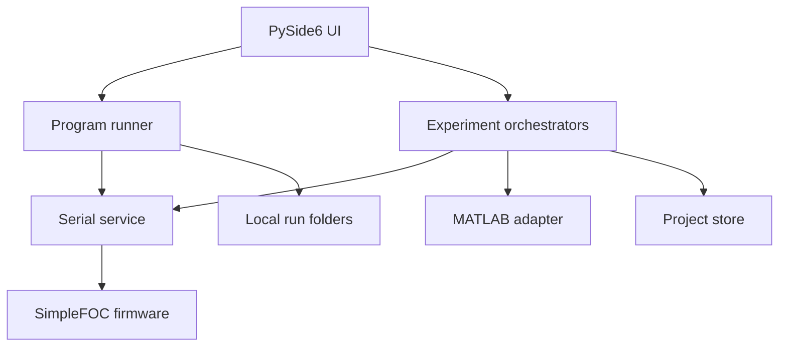
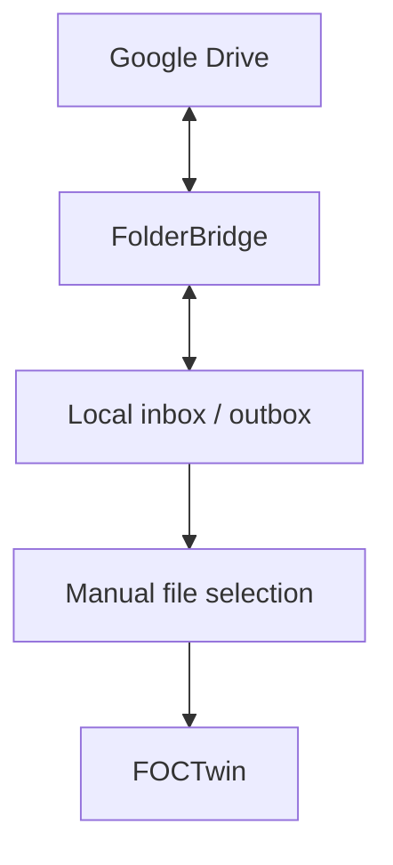

# Architecture

FOCTwin 0.5.0b2 разделяет управление мотором, выполнение локальных программ, хранение данных и
MATLAB. Google Drive и FolderBridge находятся за границей приложения.

Внешний файловый транспорт выглядит отдельно:

Стрелка от локального файла к FOCTwin означает только ручное открытие. Файл, FolderBridge или
Google Drive не могут нажать **«Запустить»** и не имеют доступа к Serial через FOCTwin.

## Program runner

Runner компилирует только два вида выполняемых строк: один ASCII-токен Commander с активным ID
мотора и `WAIT <секунды>`. Он не содержит shell, Python, произвольного импорта, сетевого клиента,
условий, циклов или общего механизма команд.

После ручной проверки и запуска runner:

1. создаёт уникальную папку запуска и сохраняет точный текст программы;
2. запускает отдельную запись телеметрии;
3. отправляет Commander-строки по одной, а задержки выполняет через неблокирующий Qt timer;
4. дописывает каждое действие и ответ платы в JSONL;
5. завершает запуск итоговым `summary.json`.

Потеря Serial, ошибка записи, ручная остановка или аварийный стоп завершают программу. Она не
возобновляется после переподключения. Нормальное завершение не добавляет скрытых Commander-команд:
безопасное окончание, например `A0` и `AE0`, должно быть явно видно в исходнике.

## Serial device service

Serial-сервис читает список существующих портов, передаёт строки Commander, разбирает ответы и
телеметрию и выполняет best-effort аварийную последовательность. Сохранённое имя COM не считается
существующим портом. Сервис не зависит от Google Drive.

## Experiment orchestrators

Диагностический токовый опыт и идентификационный тест трения остаются отдельными защищёнными
state machine. Они владеют своими пределами, checkpoint, восстановлением после аппаратного обрыва
и проектными экспортами. Обычная `.focscript`-программа не использует их внутренние состояния и
не может выполняться одновременно с ними.

## MATLAB adapter

Python и MATLAB обмениваются версионированными JSON request/result. `foctwin_run_simulation`
использует `Simulink.SimulationInput.setVariable`, не полагаясь на legacy base workspace.

## Storage

Папка проекта содержит данные сложных экспериментов:

- `telemetry/` — сырые отсчёты;
- `checkpoints/` — атомарные checkpoint;
- `exports/` — JSON, Excel и ZIP;
- SQLite — события, опыты и история принятых параметров.

Папки обычных программ независимы от проекта. По умолчанию используются:

- `Документы\AutotunerExchange\inbox\programs` — предлагаемый каталог открытия;
- `Документы\AutotunerExchange\outbox\runs` — результаты запусков.

Обе папки можно заменить обычным выбором пути в интерфейсе.
