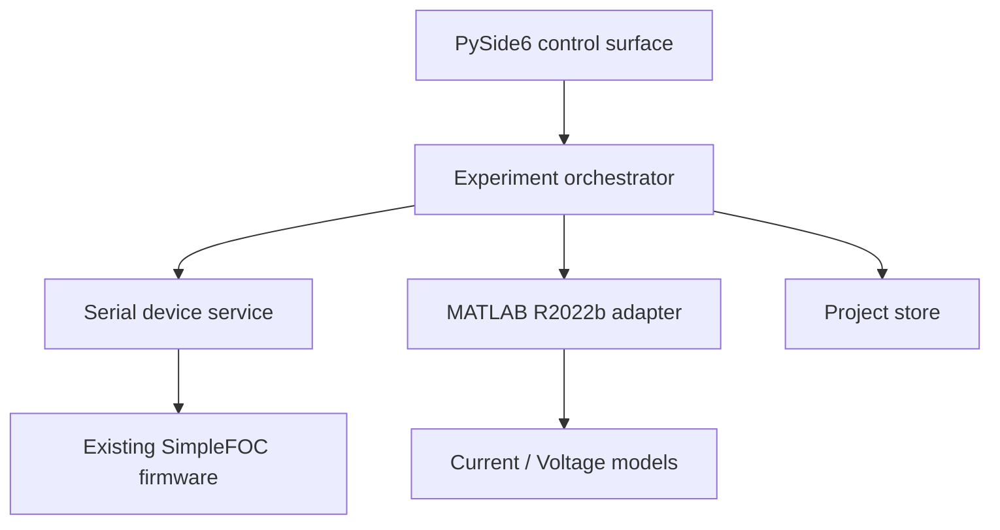

# Architecture

FOCTwin is split so that UI failures, MATLAB failures and hardware I/O do not share mutable
state directly.

## Boundaries

### Python UI

Displays every editable value and delegates work. It must never own the only copy of a
checkpoint or accepted parameter set.

### Experiment orchestrator

Future state machine with explicit states such as `queued`, `preflight`, `running`,
`validating`, `accepted`, `rejected`, `interrupted` and `failed`. Resume operates at a trial
boundary, not in the middle of physical motion.

### Serial device service

Encodes the existing SimpleFOC Commander grammar, reads monitor lines and executes the
best-effort emergency sequence. It remains independent from Qt so it can later move into a
separate watchdog process without changing protocol code.

### MATLAB adapter

Python and MATLAB exchange versioned JSON request/result files. `foctwin_run_simulation`
uses `Simulink.SimulationInput.setVariable`, avoiding the legacy base workspace. The public
schema keeps q/d controllers separate even though the supplied current model presently
shares gains.

### Project store

- SQLite: experiment metadata, events and accepted parameter history.
- `telemetry/`: complete raw samples.
- `profiles/`: versioned motor/setup profiles.
- `checkpoints/`: atomically replaced orchestration state.
- `exports/`: user-created JSON/Excel output.
- `logs/`: verbose diagnostic logs.

The user's chosen project folder is portable; the application installation contains no
irreplaceable experiment state.

