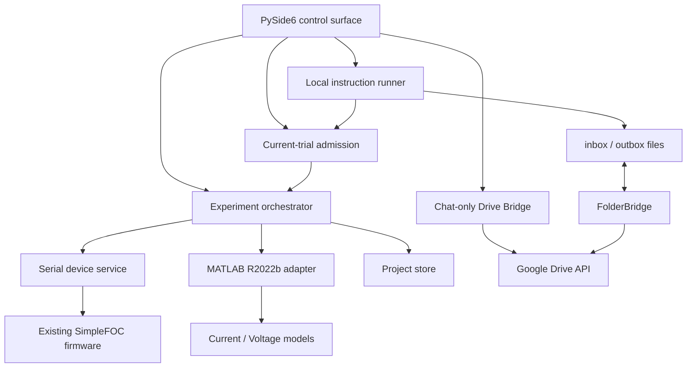

# Architecture

FOCTwin is split so that UI failures, MATLAB failures and hardware I/O do not share mutable
state directly.

## Boundaries

### Python UI

Displays every editable value and delegates work. It must never own the only copy of a
checkpoint or accepted parameter set.

### Experiment orchestrator

The direct-tuning workspace has a separate guarded current-trial state machine. It owns transport,
a low-voltage current-sense preflight, PWM-off reconfiguration, neutral baseline, current step,
post-step zero, return, recovery, complete and aborted phases. Its checkpoint rule is intentionally
simple: after any interruption, discard the partial in-memory measurement and repeat the whole
physical trial.

The identification state machine remains the two-stage actuator/friction experiment. It has explicit
baseline, direct-Uq pulse, pulse pause, velocity reconfiguration, zero, settling, measuring,
recovery, complete and aborted phases. A telemetry/Serial interruption commands a best-effort
stop and repeats the interrupted pulse or point after the stream is fresh again. Durable resume
starts at a checkpoint boundary; it never tries to continue the middle of a physical motion.

### Serial device service

Encodes the existing SimpleFOC Commander grammar, reads monitor lines and executes the
best-effort emergency sequence. It remains independent from Qt so it can later move into a
separate watchdog process without changing protocol code.

### Drive Bridge

The optional home-test Drive Bridge is parallel to the experiment orchestrator, not inside it. It
owns only OAuth, a local atomic queue and four small Drive files. FOCTwin and ChatGPT write to
different JSONL streams, so neither side overwrites the other side's newly appended messages.
Schema 1 accepts `chat` only: records with any other kind are discarded before they reach the UI,
and the module has no dependency on Serial, Commander or a motor experiment state machine.

The refresh token is stored through Windows Credential Manager. Local state contains file IDs,
ETags, cached chat and unsent messages but no OAuth refresh token. Google Drive Desktop is not a
dependency.

### Local instruction runner and shared admission controller

The instruction runner is a second parallel communication path. FolderBridge owns all
network delivery; FOCTwin sees ordinary files below a user-selected exchange root. The runner
accepts one immutable JSON file per command and writes one immutable JSON file per event. Its
SQLite journal is outside the synchronized tree and stores UUID/content-hash deduplication,
command state and event payloads across process or power interruption.

In 0.4.2b4 schema 1 exposes `run_current_trial`, `start_current_trial` and
`cancel_current_trial`. The instruction
backend still imports neither Qt nor Serial, Commander, friction or current-trial modules. It has
no generic dispatch, interpreter, shell or executable-launch path. A narrow callback reaches a
new admission controller which owns only validated current-trial requests and its own SQLite
journal; the controller itself has no Serial, Commander or Qt dependency.

The local button and file instruction use the same configuration validation and admission states.
A local button can become `ready` only after visible confirmation and a second fresh environment
check. A file instruction can simulate the plan or wait for a motor and local permission. In the
`Инструкции` window a person may arm exactly one immutable command ID without a timer; a separate
`start_current_trial` consumes that permission once. Restart or a changed safety condition
returns the plan to `waiting_for_permission`. The runner cannot send generic Serial or Commander
text; only the narrow attended start/abort callbacks reach the existing orchestrator.

### MATLAB adapter

Python and MATLAB exchange versioned JSON request/result files. `foctwin_run_simulation`
uses `Simulink.SimulationInput.setVariable`, avoiding the legacy base workspace. The public
schema keeps q/d controllers separate even though the supplied current model presently
shares gains.

### Project store

- SQLite: experiment metadata, events and accepted parameter history.
- `telemetry/`: complete raw samples.
- `profiles/`: versioned motor/setup profiles.
- `checkpoints/`: atomically replaced orchestration state.
- `exports/`: user-created JSON/Excel output and self-contained experiment ZIP bundles.
- `logs/`: verbose diagnostic logs.

The user's chosen project folder is portable; the application installation contains no
irreplaceable experiment state.
